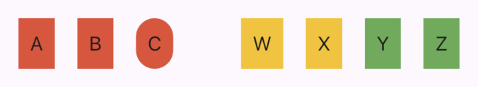

# Flutter InheritedWidget



```dart
import 'package:flutter/material.dart';

void main() {
  runApp(const App());
}

class App extends StatelessWidget {
  const App({super.key});

  @override
  Widget build(BuildContext context) {
    return MaterialApp(
      home: Material(
        child: Row(
          spacing: 48,
          mainAxisAlignment: MainAxisAlignment.center,
          children: [
            // Первая группа, передаём красный цвет
            ColorGroup(
              color: Colors.red,
              children: [
                // Элементы группы наследуют красный цвет
                ColorGroupItem(label: 'A'),
                ColorGroupItem(label: 'B'),
                // Оборачивание в промежуточный виджет, не мешает получить дынные
                ClipRRect(
                  borderRadius: BorderRadius.circular(16),
                  child: ColorGroupItem(label: 'C'),
                ),
              ],
            ),
            // Вторая группа, передаём янтарный цвет
            ColorGroup(
              color: Colors.amber,
              children: [
                // Элементы группы наследуют янтарный цвет
                ColorGroupItem(label: 'W'),
                ColorGroupItem(label: 'X'),
                // Группа внутри группы с зелёным цветом
                ColorGroup(
                  color: Colors.green,
                  children: [
                    // Элементы группы наследуют зелёный цвет (ближайшей группы)
                    ColorGroupItem(label: 'Y'),
                    ColorGroupItem(label: 'Z'),
                  ],
                ),
              ],
            ),
          ],
        ),
      ),
    );
  }
}

// InheritedWidget
class InheritedColorGroup extends InheritedWidget {
  // Данные которые нужны будут ниже по дереву. Для нашей задачи это цвет
  final Color color;

  const InheritedColorGroup({
    super.key,
    required super.child,
    required this.color,
  });

  // Хеплер необязательного получения InheritedWidget из контекста.
  // Используется когда оборачивание InheritedWidget опционально.
  // Например, если надо сделать, чтобы ColorGroupItem можно использовать без ColorGroup.
  static InheritedColorGroup? maybeOf(BuildContext context) {
    return context.dependOnInheritedWidgetOfExactType<InheritedColorGroup>();
  }

  // Хеплер получения InheritedWidget из контекста
  static InheritedColorGroup of(BuildContext context) {
    final InheritedColorGroup? result = maybeOf(context);
    assert(result != null, 'No InheritedColorGroup found in context');
    return result!;
  }

  // Определяет уведомить ли зависящие от InheritedWidget виджеты.
  // Это те, которые подписались через dependOnInheritedWidgetOfExactType (InheritedWidget.of).
  @override
  bool updateShouldNotify(InheritedColorGroup oldWidget) {
    return color != oldWidget.color;
  }
}

// Виджет, который будет создавать InheritedColorGroup с нужными данными
// и принимать список виджетов для отрисовки внутри себя
class ColorGroup extends StatelessWidget {
  final Color color;
  final List<Widget> children;

  const ColorGroup({super.key, required this.color, required this.children});

  @override
  Widget build(BuildContext context) {
    return InheritedColorGroup(
      color: color,
      child: Row(
        spacing: 16,
        mainAxisAlignment: MainAxisAlignment.center,
        children: children,
      ),
    );
  }
}

// Виджет, который будет получать цвет из InheritedColorGroup, находящегося по дереву выше
class ColorGroupItem extends StatelessWidget {
  final String label;

  const ColorGroupItem({super.key, required this.label});

  @override
  Widget build(BuildContext context) {
    // Получаем цвет из InheritedWidget
    final color = InheritedColorGroup.of(context).color;

    return Container(
      color: color,
      padding: EdgeInsets.all(8),
      child: Text(label),
    );
  }
}
```